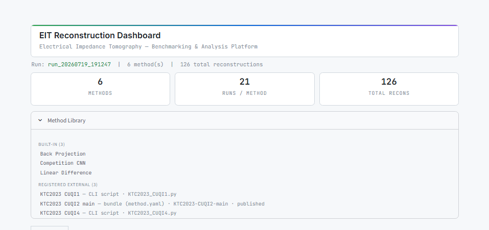
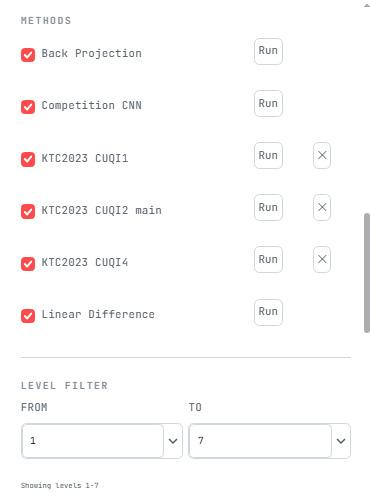
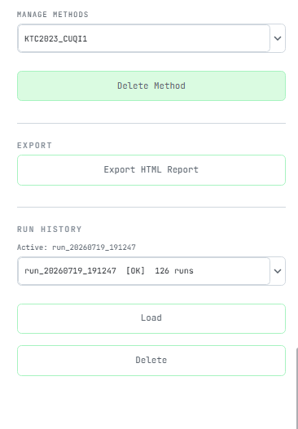
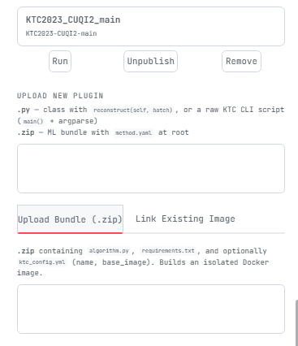
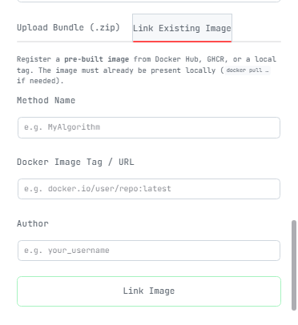

# EIT Reconstruction Benchmark Dashboard

[](https://github.com/Tannaz2001/ktc-eit-framework/actions/workflows/ci.yml)
[](https://www.python.org/)

**A benchmarking platform for Electrical Impedance Tomography (EIT) image-reconstruction algorithms.**

---

## What is this?

This project runs multiple algorithms that try to "see inside" an object using only
electrical measurements taken at its surface — a technique called **EIT**. Think of it like
an X-ray, but using electricity instead of radiation.

The algorithms are scored on how accurately they reconstruct an image of what's inside
a water tank (the test object). This dashboard lets you:

- **Run** multiple reconstruction algorithms at once across 7 difficulty levels
- **Compare** their scores side by side on an interactive leaderboard
- **Add your own algorithm** in three different ways (see [Adding Your Own Method](#7-adding-your-own-method))
- **Export** a plain-language HTML report summarising the results

> **You do not need to understand EIT to use this dashboard.** You only need to follow the
> setup steps below.

---

## Table of Contents

1. [Before You Start — Install the Prerequisites](#1-before-you-start--install-the-prerequisites)
2. [Get the Code](#2-get-the-code)
3. [Set Up the Python Environment](#3-set-up-the-python-environment)
4. [Run the Dashboard](#4-run-the-dashboard)
5. [What You Will See](#5-what-you-will-see)
6. [Run the Benchmark](#6-run-the-benchmark)
7. [Adding Your Own Method](#7-adding-your-own-method)
   - [Path A — Upload a Bundle (.zip)](#path-a--upload-a-bundle-zip)
   - [Path B — Link an Existing Docker Image](#path-b--link-an-existing-docker-image)
   - [Path C — Drop in a Python Script](#path-c--drop-in-a-python-script)
8. [How Scoring Works](#8-how-scoring-works)
9. [Project Structure](#9-project-structure)
10. [Troubleshooting](#10-troubleshooting)
11. [Team](#11-team)

---

## 1. Before You Start — Install the Prerequisites

You need the following tools installed before anything else will work. Install them in
order — each one is needed before the next step.

---

### Python 3.10 or newer

Python is the programming language the dashboard runs on.

1. Go to <https://www.python.org/downloads/>
2. Download the latest **Python 3.x** release for your operating system
3. **Windows users — critical step:** during installation, tick the checkbox that says
   **"Add Python to PATH"** before clicking Install. If you miss this, every `python`
   command you type will fail with "command not found", and you will need to reinstall.
4. Open a terminal (PowerShell on Windows, Terminal on Mac/Linux) and confirm it worked:
   ```
   python --version
   ```
   You should see something like `Python 3.11.4`. If you see an error, Python is not on
   your PATH — reinstall and tick that checkbox.

---

### Git

Git is the tool that downloads (clones) this project onto your computer.

1. Go to <https://git-scm.com/downloads>
2. Download and install Git (all default options during setup are fine)
3. Confirm it worked by opening a terminal and running:
   ```
   git --version
   ```
   You should see something like `git version 2.42.0`.

---

### Docker Desktop *(required only for Path A / Path B method addition)*

Docker lets you package and run algorithms in isolated containers. You only need it if
you want to **add new methods** using the ZIP upload (Path A) or Docker image link (Path B)
flows. If you only want to run the existing built-in algorithms, you can skip Docker.

1. Go to <https://www.docker.com/products/docker-desktop>
2. Download and install **Docker Desktop** (free)
3. After installation, open Docker Desktop from your Start menu (Windows) or Applications
   (Mac) and wait until the status bar reads **"Docker Desktop is running"** — this can
   take 30–60 seconds on first launch
4. Confirm in a terminal:
   ```
   docker --version
   ```
   You should see something like `Docker version 24.0.5`.

> **Keep Docker Desktop open while using Path A or Path B.** The dashboard talks to Docker
> in the background. If Docker Desktop is closed, image builds will silently fail.

---

## 2. Get the Code

Open a terminal, navigate to the folder where you want to store the project, then run:

```powershell
git clone https://github.com/Tannaz2001/ktc-eit-framework.git
cd ktc-eit-framework
```

This downloads the entire project — including the KTC 2023 evaluation dataset and one
pre-computed demo run — directly from GitHub. No separate data download is needed.

After cloning, your folder will look like this:

```
ktc-eit-framework/
├── app.py                  ← the dashboard (you run this)
├── run.py                  ← command-line benchmark runner
├── EvaluationData/         ← KTC 2023 voltage measurements and ground truths
├── external_methods/       ← drop your own .py scripts here (Path C)
├── configs/                ← benchmark configuration files
├── outputs/                ← results appear here after a benchmark run
└── requirements.txt        ← Python package list
```

---

## 3. Set Up the Python Environment

A **virtual environment** keeps this project's packages completely separate from every
other Python project on your computer. Think of it as a private sandbox — what you install
here does not interfere with anything else, and vice versa.

**Run all four steps below, in order, from inside the project folder:**

```powershell
# Step 1 — Create the sandbox (run this once, ever — not every time you open the project)
python -m venv venv
```

```powershell
# Step 2 — Activate the sandbox
# On Windows (PowerShell):
.\venv\Scripts\Activate.ps1
# On Mac / Linux:
source venv/bin/activate
```

After Step 2, your terminal prompt gains a `(venv)` prefix:

```
(venv) C:\ktc-eit-framework>
```

That `(venv)` prefix means the sandbox is active. **If you ever open a new terminal
window, you must run Step 2 again** — the activation does not survive across sessions.

```powershell
# Step 3 — Install all required packages into the sandbox (takes 2–5 minutes)
pip install -r requirements.txt
```

```powershell
# Step 4 — Install the framework itself (REQUIRED — do not skip this)
pip install -e .
```

> **Why is Step 4 required?**
> Without it the app crashes immediately with
> `ModuleNotFoundError: No module named 'ktc_framework'`.
> `pip install -e .` registers the `src/` folder so Python can find the framework code.
> You only need to run this once (or again if you move the project folder).

---

## 4. Run the Dashboard

There are two ways to run the dashboard. Pick whichever fits your setup.

---

### Option A — Python virtual environment (recommended after cloning)

With your virtual environment active (you see `(venv)` in the prompt), run:

```powershell
streamlit run app.py
```

After a few seconds your terminal will print:

```
  You can now view your Streamlit app in your browser.

  Local URL: http://localhost:8501
  Network URL: http://192.168.x.x:8501
```

Open <http://localhost:8501> in your browser. The **EIT Bench** dashboard loads
immediately and shows the pre-computed demo run — no benchmark run needed on first launch.



> **"streamlit: command not found"?**
> Your virtual environment is not active. Run `.\venv\Scripts\Activate.ps1` (Windows) or
> `source venv/bin/activate` (Mac/Linux) and try again.

> **Page loads blank or shows a spinner that never ends?**
> Wait 10–15 seconds and refresh. Streamlit takes a moment to compile on the first load.

---

### Option B — Docker (no Python or Git install needed)

If you have Docker Desktop installed and running, you can skip sections 2–3 entirely and
run the dashboard directly from the pre-built image published to Docker Hub:

```powershell
docker pull sahil2705/ktc-dashboard:full
docker run -p 8501:8501 -v ktc_outputs:/app/outputs sahil2705/ktc-dashboard:full
```

Then open <http://localhost:8501> in your browser.

**Breaking down the `docker run` command:**

| Part | What it does |
|---|---|
| `-p 8501:8501` | Maps the container's port 8501 to your computer's port 8501 so the browser can reach it |
| `-v ktc_outputs:/app/outputs` | Creates a named volume called `ktc_outputs` on your machine. Every benchmark run is saved there and survives container restarts. Without this flag, results vanish when you stop the container. |
| `sahil2705/ktc-dashboard:full` | The Docker Hub image — full version includes all 6 built-in methods (CompetitionCNN, KTC variants, BackProjection, LinearDifference) |

> **The dashboard already shows one pre-computed benchmark run on first boot.** You can
> browse the leaderboard, charts, and figures immediately without running anything first.

> **To stop the container:** press `Ctrl+C` in the terminal, or run `docker stop ktc-dashboard`.

> **To restart later:** just run the `docker run` command again — the `ktc_outputs` volume
> preserves all previous runs.

---

## 5. What You Will See

The dashboard has two main areas: the **sidebar** on the left and the **main panel** on the right.

---

### Sidebar (left column)

The sidebar is where you control everything. It has several collapsible sections:

**Dataset Settings**
Tells the app where to find the evaluation data. The default path (`EvaluationData/`)
works out of the box after cloning. Click **"Validate paths"** to confirm all data files
are found. Every row should show a green tick. If any show red, see
[Troubleshooting](#10-troubleshooting).

**Run Benchmark**
Click **"Run all methods"** to start a full benchmark. Before reconstructions begin, the
terminal prints a METHOD DISCOVERY REPORT confirming which methods were found (see
[Run the Benchmark](#6-run-the-benchmark)).

**Methods**
Tick-boxes for every registered method. Un-tick a method to hide it from the charts
without deleting it. Re-tick to bring it back.



**Metrics**
Tick-boxes for which performance metrics to display in the charts (KTC Score, Dice,
IoU, Hull IoU, Runtime).

**Add Method**
Three tabs — Upload Bundle, Link Image, Refresh — corresponding to Paths A, B, and C
for adding new algorithms (see [Section 7](#7-adding-your-own-method)).

**Manage Methods**
Drop-down to select any registered method and a **Delete Method** button to remove it.

**Export**
Click **"Export HTML Report"** to generate a plain-language report summarising the
current run's results. The report is saved to `outputs/<run_name>/report.html`.

**Run History**
Drop-down showing all past benchmark runs stored in `outputs/`. The active run
(displayed in the charts) is shown at the top. Switch to any previous run by selecting
it from the list.



---

### Main panel — tabs

**Leaderboard**
A ranked bar chart of all methods sorted by their composite KTC Score (0–100). Each
bar is colour-coded by letter grade:

| Grade | Score range | Colour |
|---|---|---|
| A | ≥ 60 | Green |
| B | ≥ 30 | Blue |
| C | ≥ 10 | Amber |
| D | < 10 | Red |

An insight banner at the top explains in plain English which method is winning and why
(e.g., "KTC2023_CUQI1 is winning — its edge comes mainly from the resistive object").

**Degradation**
A line chart showing how each method's score changes as the difficulty level increases
from 1 (easy — many electrodes) to 7 (hard — few electrodes). A method that degrades
steeply struggles with sparse data.

**Metrics**
A per-method breakdown of every individual metric: KTC Score, Dice Resistive, Dice
Conductive, IoU, Hull IoU, and mean Runtime in milliseconds. Use this tab to understand
*why* a method ranks where it does.

**Radar**
A spider (radar) chart that places all methods on the same axes simultaneously. Useful
for spotting which methods are balanced across all metrics vs. strong on one but weak
on another.

**Geometry**
A spatial heatmap showing whether each method correctly locates inclusions inside the
tank. Helps diagnose whether errors are random or consistently in a particular region.

**Images**
Side-by-side image comparisons: each method's reconstruction output next to the
ground-truth segmentation mask, for every level and sample. Use this tab to visually
inspect reconstruction quality.

---

### Dashboard header metrics

At the very top of the main panel, three cards summarise the active run at a glance:

| Card | What it shows |
|---|---|
| **Methods** | How many algorithms are registered in this run |
| **Runs / Method** | How many reconstruction samples each method produced (levels × samples = 7 × 3 = 21) |
| **Total Recons** | Total number of individual reconstructions (methods × runs/method) |

A **Method Library** section below the cards lists every method in the run, grouped into
Built-in (shipped with the framework) and Registered External (added by you).

---

## 6. Run the Benchmark

### Via the dashboard (easiest)

1. Make sure the dashboard is open in your browser at <http://localhost:8501>
2. In the sidebar, click **"Run all methods"**
3. Watch the terminal — a **METHOD DISCOVERY REPORT** prints immediately (before any
   reconstruction starts), listing every method that will run:

```
── Method Discovery ──────────────────────────────────────
  Registered in registry : 6 methods
  Scheduled for execution: 6 methods
    ✓ KTC2023_CUQI4                   (KTC2023_CUQI4.py)
    ✓ BackProjection                  (builtin)
    ✓ CompetitionCNN                  (builtin)
    ✓ LinearDifferenceReconstruction  (builtin)
    ✓ KTC2023_CUQI2_main              (KTC2023-CUQI2-main)
    ✓ KTC2023_CUQI1                   (KTC2023_CUQI1.py)
──────────────────────────────────────────────────────────
```

A green `✓` means the method was found and is ready. A red `✗` means a file is
missing — the run continues without that method. See [Troubleshooting](#10-troubleshooting)
to fix missing methods.

4. Wait for the run to finish. A full benchmark (6 methods × 7 levels × 3 samples =
   **126 reconstructions**) takes roughly **20–40 minutes** on a typical laptop. The
   dashboard sidebar shows progress in real time.

5. When the run completes, the dashboard refreshes automatically and the leaderboard
   populates with results.

Results are saved to `outputs/run_<timestamp>/` and appear in the **Run History**
drop-down so you can revisit them later.

---

### Via the command line (alternative)

If you prefer not to use the browser, you can run the benchmark directly:

```powershell
python run.py --config configs/ktc_all_methods.yaml
```

The terminal prints progress for every reconstruction. Results are saved to `outputs/`
in the same format as the dashboard run, so you can load them in the dashboard later.

To run only specific methods or levels, edit `configs/ktc_all_methods.yaml` and change
the `methods` or `levels` lists before running.

---

## 7. Adding Your Own Method

You can plug any reconstruction algorithm into the benchmark in **three ways**:

| | Path | Best for |
|---|---|---|
| **A** | [Upload a Bundle (.zip)](#path-a--upload-a-bundle-zip) | An algorithm you wrote in Python — packaged as a zip, the system builds a Docker image automatically |
| **B** | [Link an Existing Docker Image](#path-b--link-an-existing-docker-image) | An algorithm already published to Docker Hub or built locally |
| **C** | [Drop in a Python Script](#path-c--drop-in-a-python-script) | A plain `.py` CLI script that reads `.mat` files — same format as KTC 2023 competition submissions |

All three paths end with your method appearing in the **Methods** sidebar, where you can
tick it and run it alongside the built-in baselines.

---

### Path A — Upload a Bundle (.zip)

The dashboard builds a Docker image from your zip automatically. You write your algorithm
in plain Python — the system handles containerisation.

#### Prerequisites for Path A

Docker Desktop must be **open and running** (the Docker Desktop window shows "Docker
Desktop is running"). The build happens in the background; if Docker is not running, the
upload will appear to succeed but the build will silently fail.

---

#### Step 1 — Prepare the three files

Your zip must contain **exactly** these files. Use these exact filenames — do not rename them:

```
my_method.zip
├── algorithm.py      ← your reconstruction code (required)
├── requirements.txt  ← Python packages your code needs (required, can be empty)
└── ktc_config.yml    ← method name and base image (optional but strongly recommended)
```

---

**`algorithm.py`** — must define a function named exactly `reconstruct(batch)`.

The framework calls this function once per sample. The `batch` argument is a `DataBatch`
object with the following fields:

| Field | Type | Description |
|---|---|---|
| `batch.voltages` | `numpy.ndarray`, shape `(76,)` | Voltage measurements from the 32-electrode ring |
| `batch.injection_patterns` | `numpy.ndarray`, shape `(32, 76)` | Which electrode pairs are active at each step |
| `batch.ground_truth` | `numpy.ndarray`, shape `(256, 256)`, dtype `uint8` | True segmentation mask (0/1/2) — do not use this in your algorithm, only for debugging |
| `batch.level` | `int`, 1–7 | Difficulty level — higher means fewer active electrodes |
| `batch.sample_id` | `str` | e.g. `"data1"` — identifies which measurement file is being processed |
| `batch.mesh` | object or `None` | FEM mesh — can be `None`; ignore if your method does not need it |
| `batch.reference_voltages` | `numpy.ndarray` or `None` | Empty-tank reference voltages, shape `(76,)` |
| `batch.measurement_patterns` | `numpy.ndarray` or `None` | Additional measurement metadata |

Your function must return a **numpy array of shape `(256, 256)`** with integer labels:
- `0` = background (water / tank wall)
- `1` = resistive inclusion (plastic)
- `2` = conductive inclusion (metal)

**Minimal working example** — copy this and replace the reconstruction logic:

```python
# algorithm.py

import numpy as np

def reconstruct(batch):
    """
    Reconstruct a 256x256 segmentation map from EIT measurements.

    Parameters
    ----------
    batch : DataBatch
        .voltages           shape (76,)      — voltage measurements
        .injection_patterns shape (32, 76)   — active electrode patterns
        .level              int 1–7          — difficulty
        .reference_voltages shape (76,) or None
        .ground_truth       shape (256, 256) — true mask (for debugging only)

    Returns
    -------
    numpy.ndarray, shape (256, 256), dtype uint8
        Segmentation map: 0=background, 1=resistive, 2=conductive
    """
    # ─── Replace everything below with your algorithm ───────────────────────
    voltages = batch.voltages                        # shape (76,)
    ref      = batch.reference_voltages              # shape (76,) or None
    level    = batch.level                           # int 1–7

    # Difference signal (simplest useful feature)
    diff = voltages - ref if ref is not None else voltages

    # Placeholder: return an empty-tank prediction (scores 0.0 on KTC metric)
    reconstruction = np.zeros((256, 256), dtype=np.uint8)
    return reconstruction
    # ────────────────────────────────────────────────────────────────────────
```

---

**`requirements.txt`** — one package name per line. `numpy` and `scipy` are always
available in the base image — only list extras your algorithm needs.

```
# requirements.txt
# Leave this file empty if your algorithm uses only numpy and scipy.
scikit-learn
matplotlib
torch
```

If a package name is wrong (e.g., `sklearn` instead of `scikit-learn`), the Docker build
will fail. Use the exact PyPI package name.

---

**`ktc_config.yml`** — sets the display name and the base Docker image for the build.

```yaml
# ktc_config.yml
name: MyAlgorithm             # shown in the dashboard sidebar (letters/numbers/underscores only, no spaces)
base_image: python:3.10-slim  # base Docker image; use pytorch/pytorch:latest if you need PyTorch
```

If you omit this file, the method name defaults to the zip filename with special
characters replaced by underscores (e.g., `my-method_v2.zip` → `my_method_v2`).

---

#### Step 2 — Zip the files

On Windows, select all three files → right-click → **"Compress to ZIP file"**.
On Mac, select all three → right-click → **"Compress 3 Items"**.

The zip must contain the files at the **top level**, not inside a subfolder:

```
✓ Correct:   my_method.zip/algorithm.py
✗ Wrong:     my_method.zip/my_method_folder/algorithm.py
```

---

#### Step 3 — Upload via the dashboard sidebar

1. Open the dashboard at <http://localhost:8501>
2. Scroll down in the sidebar to the **"Add Method"** section
3. Click the **"Upload Bundle (.zip)"** tab
4. Click the upload area and select your `.zip` file



5. A confirmation message appears immediately:
   > *"⏳ Building 'MyAlgorithm' in the background — dashboard stays live. Refresh to check status."*

---

#### Step 4 — Wait for the Docker build

The build runs in the background while you continue using the dashboard. Build time
depends on the size of your `requirements.txt`:

| `requirements.txt` size | Typical build time |
|---|---|
| Empty (numpy/scipy only) | 1–2 minutes |
| Small extras (scikit-learn, matplotlib) | 2–4 minutes |
| Large frameworks (PyTorch, TensorFlow) | 5–15 minutes |

Refresh the page and check the Methods sidebar:

| Badge | Meaning |
|---|---|
| *(no badge)* | Build succeeded — method is ready to run |
| **⏳ Building…** | Still in progress — wait and refresh again |
| **⚠ Build failed** | Something in the zip was invalid — see below |

If the build fails, the most common causes are:
- A misspelled package name in `requirements.txt`
- A syntax error in `algorithm.py`
- Docker Desktop was not running when you uploaded

Delete the method from **Manage Methods → Delete Method**, fix the issue, re-zip, and
upload again.

---

#### Step 5 — Run it

Tick your method in the Methods checklist and click **"Run all methods"** in the sidebar.
Your method runs alongside the built-in baselines and appears on the leaderboard when done.

---

### Path B — Link an Existing Docker Image

Use this if your algorithm is already packaged as a Docker image — published to Docker
Hub, GitHub Container Registry (GHCR), or built locally.

#### What your image must do

The benchmark calls your container like this:

```bash
docker run --rm -v /tmp/ktc_run:/data YOUR_IMAGE_TAG /data/input.json /data/output.npy
```

Your container's entrypoint must:
1. Read the JSON file at the first positional argument (`/data/input.json`)
2. Compute the reconstruction
3. Write the result as a NumPy `.npy` file to the second positional argument (`/data/output.npy`)

**Input file format (`input.json`):**

```json
{
  "voltages":             { "data": "<base64-encoded bytes>", "dtype": "float32", "shape": [76] },
  "injection_patterns":   { "data": "<base64-encoded bytes>", "dtype": "float32", "shape": [32, 76] },
  "ground_truth":         { "data": "<base64-encoded bytes>", "dtype": "uint8",   "shape": [256, 256] },
  "level":                3,
  "sample_id":            "data1",
  "mesh":                 null,
  "reference_voltages":   null,
  "measurement_patterns": null
}
```

To decode arrays inside your container:

```python
import json, base64, numpy as np

with open("/data/input.json") as f:
    payload = json.load(f)

def decode(d):
    raw = base64.b64decode(d["data"])
    return np.frombuffer(raw, dtype=d["dtype"]).reshape(d["shape"])

voltages = decode(payload["voltages"])
level    = int(payload["level"])
ref      = decode(payload["reference_voltages"]) if payload["reference_voltages"] else None
```

**Output file format (`output.npy`):**

Your container must write a shape `(256, 256)` uint8 NumPy array:

```python
import numpy as np

reconstruction = np.zeros((256, 256), dtype=np.uint8)  # ← replace with your result
np.save("/data/output.npy", reconstruction)
```

---

#### Steps

1. Make sure the image is available locally. If it is on Docker Hub:
   ```powershell
   docker pull your-username/your-image:latest
   ```
   If it was built locally, verify it shows up:
   ```powershell
   docker images
   ```

2. In the dashboard sidebar, click **"Add Method"** → **"Link Existing Image"** tab



3. Fill in all three fields:

   | Field | Example | Notes |
   |---|---|---|
   | **Method Name** | `MyDockerMethod` | Letters, numbers, underscores only — no spaces |
   | **Docker Image Tag / URL** | `your-username/my-eit-method:latest` | Exact tag as shown in `docker images` |
   | **Author** | `Your Name` | Optional — shown in the method registry |

4. Click **"Link Image"**

The method is registered immediately (no build wait) and appears in the Methods
checklist. Tick it and click **"Run all methods"** to benchmark it.

---

### Path C — Drop in a Python Script

Use this if your algorithm is a plain Python script that reads EIT voltage data from a
folder and writes `.mat` reconstruction files — the same format used by all KTC 2023
competition submissions. No Docker is needed for this path.

#### What your script must look like

Your script must follow the **KTC CLI contract**. Three rules are non-negotiable:

1. `import argparse` at the top
2. A `def main()` function that parses exactly three positional arguments
3. `if __name__ == "__main__": main()` at the bottom

**The three arguments the framework always passes, in this order:**

| Argument | What it is |
|---|---|
| `inputFolder` | Path to a folder containing `data1.mat`, `data2.mat`, `data3.mat` (voltage measurements) and `ref.mat` (empty-tank reference voltages) |
| `outputFolder` | Path where you must write `1.mat`, `2.mat`, `3.mat` (one per input data file) |
| `categoryNbr` | Integer 1–7 representing the difficulty level (1 = easiest, 7 = hardest) |

**Full template — copy this, fill in your algorithm, and save it as a `.py` file:**

```python
# my_method.py
# Drop this file into external_methods/ and click "Refresh methods" in the sidebar.

import argparse
import glob
import os

import numpy as np
import scipy.io


def main():
    # ── Parse the three positional arguments ────────────────────────────────
    # The framework always calls:  python my_method.py <inputFolder> <outputFolder> <categoryNbr>
    parser = argparse.ArgumentParser(description="KTC EIT reconstruction method")
    parser.add_argument("inputFolder",  help="Folder containing data*.mat and ref.mat")
    parser.add_argument("outputFolder", help="Folder to write reconstruction .mat files into")
    parser.add_argument("categoryNbr",  help="Difficulty level 1–7 (1=easiest, 7=hardest)")
    args = parser.parse_args()

    level = int(args.categoryNbr)

    # ── Load the empty-tank reference voltages ───────────────────────────────
    ref_path     = os.path.join(args.inputFolder, "ref.mat")
    ref_mat      = scipy.io.loadmat(ref_path, squeeze_me=True)
    ref_voltages = ref_mat["Uelref"].flatten()      # shape (76,) — voltages with nothing in tank

    # ── Find all data files for this level/sample group ──────────────────────
    data_files = sorted(glob.glob(os.path.join(args.inputFolder, "data*.mat")))

    os.makedirs(args.outputFolder, exist_ok=True)

    for i, data_file in enumerate(data_files):
        mat      = scipy.io.loadmat(data_file, squeeze_me=True)
        voltages = mat["Uel"].flatten()             # shape (76,) — voltages with inclusion in tank
        diff     = voltages - ref_voltages          # difference from empty-tank reference

        # ====================================================================
        # YOUR RECONSTRUCTION ALGORITHM GOES HERE
        # ====================================================================
        # Inputs available:
        #   voltages     — raw voltage measurements,    shape (76,)
        #   diff         — difference from empty tank,  shape (76,)
        #   ref_voltages — reference (empty tank),      shape (76,)
        #   level        — difficulty level,            int 1–7
        #
        # Output required:
        #   reconstruction — numpy array, shape (256, 256), dtype uint8
        #   Labels:  0 = background, 1 = resistive (plastic), 2 = conductive (metal)
        # ====================================================================
        reconstruction = np.zeros((256, 256), dtype=np.uint8)   # ← replace this line

        # ── Save the output (.mat key MUST be "reconstruction") ───────────────
        # Output filenames must be 1.mat, 2.mat, 3.mat, … (matching data1, data2, data3)
        out_path = os.path.join(args.outputFolder, f"{i + 1}.mat")
        scipy.io.savemat(out_path, {"reconstruction": reconstruction})
        print(f"Saved {out_path}")


if __name__ == "__main__":
    main()
```

---

#### Steps

1. Complete your script — replace the placeholder `np.zeros(...)` line with your
   actual algorithm logic.

2. Save the file with a `.py` extension, then copy it into the `external_methods/`
   folder at the project root:

   ```powershell
   # Windows PowerShell:
   copy C:\path\to\my_method.py .\external_methods\my_method.py

   # Mac / Linux:
   cp /path/to/my_method.py ./external_methods/my_method.py
   ```

3. Open the dashboard at <http://localhost:8501>. In the sidebar, click
   **"Add Method"** → **"Refresh"** tab → **"Refresh methods"**. The dashboard scans
   `external_methods/` and your method name appears in the Methods checklist.

4. Tick your method and click **"Run all methods"**.

> **Important:** Your script runs on your **local Python environment**, not inside Docker.
> If your script imports packages that are not already installed, install them first:
> ```powershell
> pip install <package-name>
> ```
> Make sure your virtual environment is active when you do this.

> **Output `.mat` file key name:** The scorer looks for a field named exactly
> `"reconstruction"` inside each output `.mat` file. Any other key name results in a
> score of 0.0 for that sample.

---

## 8. How Scoring Works

Each reconstruction is compared to the known ground-truth segmentation mask using the
official **KTC Score** from the Kuopio Tomography Challenge 2023.

### KTC Score (0–100 scale in the dashboard)

The raw KTC score is based on **SSIM** (Structural Similarity Index), computed separately
for the resistive (plastic) and conductive (metal) regions:

```
KTC Score = (SSIM_resistive + SSIM_conductive) / 2
```

The dashboard multiplies by 100 for readability. Interpretation:

| Score | Letter Grade | Meaning |
|------:|:---:|---------|
| ≥ 60 | **A** | Excellent — reconstruction closely matches the ground truth |
| 30–59 | **B** | Good — correct general shape, some boundary errors |
| 10–29 | **C** | Fair — inclusion detected but shape/position is approximate |
| < 10 | **D** | Poor — little or no meaningful reconstruction |
| ≤ 0 | — | Worse than predicting an empty tank everywhere |

---

### Additional metrics

| Metric | Range | What it measures |
|---|---|---|
| **Dice Resistive** | 0–1 | Overlap between predicted and true resistive (plastic) region |
| **Dice Conductive** | 0–1 | Overlap between predicted and true conductive (metal) region |
| **IoU** | 0–1 | Intersection over Union — stricter than Dice; penalises over-prediction more |
| **Hull IoU** | 0–1 | Whether the inclusion was found in approximately the right geometric location |
| **Runtime (ms)** | — | Wall-clock time for one reconstruction on your machine |

A method can score well on Dice (it found the inclusion) but poorly on Hull IoU (it put
it in the wrong place). The Metrics tab breaks all of these down per method.

---

### Difficulty levels

The benchmark runs each method across 7 difficulty levels. Level 1 uses all 32 electrodes
(easy); level 7 uses only a small subset (hard). A robust method should degrade gracefully
— its score should drop slowly as level increases. Inspect the **Degradation** tab to see
how each method handles increasing difficulty.

---

## 9. Project Structure

```
ktc-eit-framework/
│
├── app.py                              ← Streamlit dashboard (main UI entry point)
├── run.py                              ← Command-line benchmark runner
├── Dockerfile                          ← Docker image build file (slim and full targets)
├── docker-compose.yml                  ← Compose file for docker compose up
├── requirements.txt                    ← Base Python dependencies (numpy, scipy, streamlit…)
├── requirements-full.txt               ← Full dependencies including TensorFlow and PyTorch
│
├── configs/
│   ├── ktc_all_methods.yaml            ← Benchmark config: which methods, levels, samples to run
│   └── registered_methods.json         ← Registry of Docker-based methods (auto-managed — do not edit)
│
├── external_methods/                   ← Drop Path C .py scripts here; Path A/B outputs also land here
│   ├── KTC2023_CUQI1.py                ← Legacy KTC 2023 competition CLI script
│   ├── KTC2023_CUQI4.py                ← Legacy KTC 2023 competition CLI script
│   └── KTC2023-CUQI2-main/             ← Bundle-style method with method.yaml manifest
│
├── src/ktc_framework/
│   ├── methods/                        ← Built-in algorithms (BackProjection, CompetitionCNN, LinearDifference)
│   │   └── method_plugin.py            ← Abstract base class all built-in methods subclass
│   ├── adapters/
│   │   ├── docker_builder.py           ← Builds Docker images (Path A) and links images (Path B)
│   │   ├── cli_plugin_wrapper.py       ← Wraps Path C scripts so the runner can call them
│   │   └── plugin_detector.py          ← Detects which contract a .py file follows
│   ├── runner/
│   │   └── experiment_runner.py        ← Loops over methods × levels × samples, writes results
│   ├── metrics/                        ← KTC score, Dice, IoU, Hull IoU, composite score computation
│   └── reporting/                      ← HTML report generator
│
├── EvaluationData/                     ← KTC 2023 dataset (included — no separate download needed)
│   └── evaluation_datasets/
│       ├── level1/ … level7/           ← Voltage .mat files per difficulty level
│       └── GroundTruths/               ← Ground-truth segmentation masks (256×256 PNG)
│
├── Codes_Matlab/                       ← Training data and FEM mesh files
├── outputs/                            ← Benchmark results (created automatically on first run)
│   ├── run_<timestamp>/
│   │   ├── scores.json                 ← Per-method KTC scores
│   │   ├── per_run_metrics.json        ← Full metric breakdown
│   │   ├── reconstructions/            ← Output PNGs per method / level / sample
│   │   ├── figures/                    ← Comparison figures for the Images tab
│   │   └── report.html                 ← Exported HTML report
│   └── latest.txt                      ← Path to the most recent run (read by the dashboard on startup)
└── docs/
    └── screenshots/                    ← Dashboard screenshots for documentation
```

---

## 10. Troubleshooting

### `ModuleNotFoundError: No module named 'ktc_framework'`

You skipped or forgot `pip install -e .`. With your venv active:
```powershell
pip install -e .
```

---

### `streamlit: command not found`

Your virtual environment is not active. Run:
```powershell
# Windows:
.\venv\Scripts\Activate.ps1
# Mac / Linux:
source venv/bin/activate
```
Then try `streamlit run app.py` again.

---

### `ModuleNotFoundError: No module named 'filelock'` (or any other missing package)

```powershell
pip install filelock
```
Replace `filelock` with the actual missing module name from the error message.

---

### Dashboard shows "No data" everywhere on first load

This means no benchmark run exists in `outputs/`. The pre-computed demo run should be
there after cloning — if it is missing, check that `outputs/run_20260719_191247/` exists.
If not, run a benchmark via the sidebar or command line:
```powershell
python run.py --config configs/ktc_all_methods.yaml
```

---

### Benchmark shows "No data" for some methods but not others

Check the terminal for the METHOD DISCOVERY REPORT printed at the start of the run.
Look for `✗` entries — those methods failed to load.

| What the terminal says | Cause | Fix |
|---|---|---|
| `✗ NOT REGISTERED SomeName` | Method file missing from `external_methods/` | Copy the file there and click "Refresh methods" |
| `FileNotFoundError: data1.mat` | `EvaluationData/` folder missing or in the wrong location | Confirm the folder exists at the project root |
| `docker run failed` | Docker image not built yet, or Docker Desktop not running | Wait for ⏳ badge to clear; confirm Docker Desktop is open |
| `TimeoutError` | Docker build timed out | Check your internet connection; retry the upload |

---

### "Validate paths" shows all ERR (red)

Click **Dataset Settings** in the sidebar and confirm **Dataset root** is set to
`EvaluationData`. Click **"Validate paths"** again. If still red, confirm the folder
exists at the root of the project:
```powershell
ls EvaluationData/
```

---

### My Path C script runs but all scores are 0.0

Two possible causes:

1. **Your reconstruction logic returns zeros** — check that you replaced the placeholder
   `np.zeros(...)` line with your actual algorithm.

2. **Wrong `.mat` key name** — the scorer looks for a field named exactly `"reconstruction"`
   inside each output `.mat` file. Check your `scipy.io.savemat` call:
   ```python
   scipy.io.savemat(out_path, {"reconstruction": reconstruction})  # ← key must be this
   ```

Check `outputs/<run_name>/failures.json` for detailed per-sample error messages.

---

### Path A build shows "⚠ Build failed"

Common causes in order of likelihood:

1. **Misspelled package name** in `requirements.txt` — e.g., `sklearn` instead of
   `scikit-learn`, or `cv2` instead of `opencv-python`
2. **Syntax error** in `algorithm.py` — test your script locally first:
   ```powershell
   python -c "import algorithm"
   ```
3. **Docker Desktop was not running** when you uploaded — restart Docker Desktop and retry
4. **ZIP structure is wrong** — the files must be at the top level of the zip, not inside
   a subfolder

Delete the method from **Manage Methods → Delete Method**, fix the issue, re-zip, and
upload again.

---

### `CompetitionCNN` does not appear or scores 0.000

`CompetitionCNN` requires TensorFlow, which is not in the base `requirements.txt`.
Install it:
```powershell
pip install tensorflow
```
If you are using the Docker image, use the `full` target — the `slim` target omits
TensorFlow.

---

### Port 8501 already in use

Another Streamlit session or Docker container is using the port. Either stop the other
process, or run on a different port:
```powershell
streamlit run app.py --server.port 8502
# or for Docker:
docker run -p 8502:8501 -v ktc_outputs:/app/outputs sahil2705/ktc-dashboard:full
```
Then open <http://localhost:8502>.

---

### RuntimeWarning: Skipping method plugin 'KTCFwd.py' / 'KTCMeshing.py'

These warnings are harmless. `KTCFwd.py` and `KTCMeshing.py` are legacy MATLAB-interfacing
scripts that depend on packages (`KTCMeshing`, `KTCcircmesh`) that are not pip-installable.
They are skipped on startup and do not affect any of the 6 benchmark methods or your
ability to add new methods.

---

## 11. Team

Developed as a summer research project on EIT reconstruction benchmarking, using the
**Kuopio Tomography Challenge (KTC) 2023** dataset and official scoring methodology.

- **Dataset & challenge:** <https://www.fips.fi/KTC2023.php>
- **Team:**
  - Tannaz Inamdar
  - Areeba Masood
  - Sahil Khan
  - Syeda Ulya Seerat
